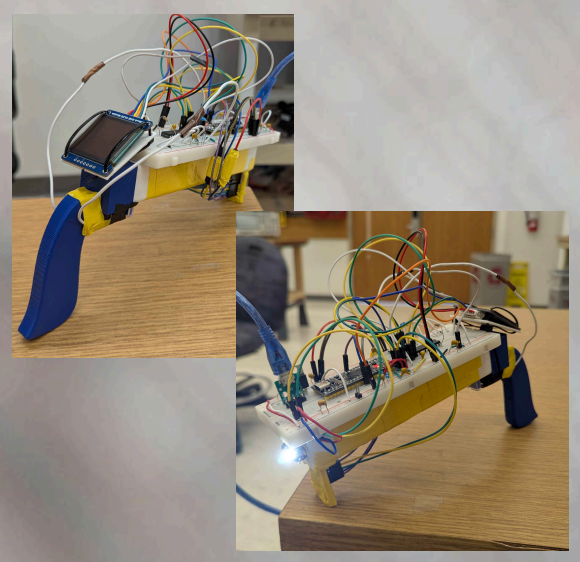
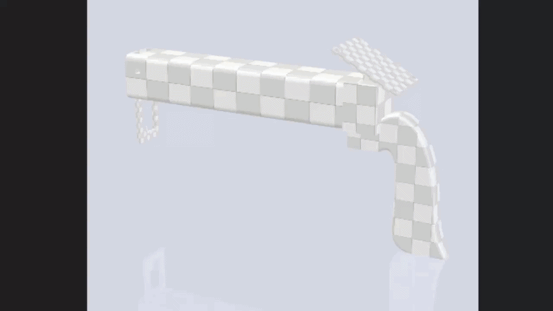

# Object Feature Scanner / Analyzer

An embedded 3D object scanner with an integrated OLED visualizer designed to capture and display depth maps and color profiles in real-time.

**Demo Video:** https://youtube.com/shorts/giUS9eJ66J0?feature=share

---

## Features

* **Ultra-Fast Data Capture:** Rapid distance and color scanning with a data collection latency as low as 3.25 milliseconds.
* **Long-Range Sensing:** Accurate object telemetry capture up to a range of 4 meters.
* **Onboard Visualizer:** Equipped with a 44.5x37mm square OLED display angled toward the user, featuring precise 1:1 pixel-to-datapoint mapping on a 16x16px grid and a 3-second refresh rate.
* **Ergonomic Handheld Form Factor:** Built using a lightweight 100g PLA 3D-printed chassis featuring a comfortable handheld grip and an integrated physical push-button trigger.

  

* **Modular Library Design:** Clean codebase splitting functionalities over I2C and SPI protocols with customizable global parameters.

---

## Hardware Architecture

The device uses a multi-processor/sensor array to offload real-time processing tasks:

| Component | Part Number | Description | Datasheet Reference |
| :--- | :--- | :--- | :--- |
| **PIC24 Microcontroller** | PIC24FJ64GA002 | Main MCU handling logic, memory buffers, and display. | [PIC24 Datasheet](https://ww1.microchip.com/downloads/aemDocuments/documents/OTH/ProductDocuments/DataSheets/39881e.pdf) |
| **Waveshare OLED Display** | SSD1327 | 128x128px screen providing real-time 3D grid rendering. | [SSD1327 Datasheet](https://robu-prod-media.s3.ap-south-1.amazonaws.com/uploads/2021/04/Waveshare-128x128-General-1.5inch-OLED-display-Module-1.pdf) |
| **Flora Color Sensor** | TCS34725 | Tracks individual surface point color into 16-bit RGBC vectors (includes illumination LED). | [TCS34725 Datasheet](https://cdn-shop.adafruit.com/datasheets/TCS34725.pdf) |
| **ToF Distance Sensor** | VL53L5CX | Multizone distance sensor returning an 8x8 grid of depth data points (64 zones total). | [VL53L5CX Datasheet](https://www.st.com/resource/en/datasheet/vl5315cx.pdf) |
| **STM32 Microcontroller** | STM32F411CEU6 | Dedicated helper chip used to reload the VL53L5CX firmware on system boot. | [STM32F411 Datasheet](https://www.st.com/resource/en/datasheet/stm32f411ce.pdf) |

---

## API Reference & Libraries

The firmware codebase is broken into several components:

### 1. Color Sensor Library (`color_sensor_lib.h`)
Manages communication with the TCS34725 color sensor over I2C and adapts telemetry data formats for the display library.
* `void PrintFrame(char byte)` – Transmits a single 8-bit value to simplify basic I2C write streams.
* `char GetByte(int byte)` – Reads the I2C input buffer to receive a byte. Handles upper/lower 16-bit color bounds and sends NACK signals accordingly.
* `void Color_Init(void)` – Performs bus setup, configures target registers, wakes up the sensor, and starts data collection.
* `void Color_Cmd(char command, char data)` – Completes a targeted I2C register write, primarily leveraged during initialization routines.
* `int Color_Read(char regAddress)` – Recombines two incoming I2C data bytes into a 16-bit int, compresses it to a 6-bit value for OLED compatibility, and returns it.
* `void Delayms(int time)` – A blocking millisecond-level delay utility used for debugging and sensor timing safety.

### 2. Button Library (`Button.h`)
Handles input capture routines from the structural handle trigger.
* `void initButton(void)` – Configures GPIO pin layouts, hardware timers, and interrupts for user trigger capture.

### 3. Circular Buffer Library (`CirBuf.h`)
Implements a First-In, First-Out (FIFO) circular buffer structure to store, filter, and process scanner depth elements before passing them to the visualizer.
* `int buffer_push(buffer_t *f, uint8_t data)` – Pushes a new element. Returns `1` on success, `0` if full.
* `int buffer_force_push(buffer_t *f, uint8_t data)` – Inserts data regardless of buffer limits, overriding older elements if needed.
* `int buffer_pop(buffer_t *f)` – Extracts and returns the oldest item in the buffer.
* `int buffer_is_empty(buffer_t *f)` – Returns `1` if empty, otherwise `0`.
* `double buffer_average(buffer_t *f)` – Computes the rolling average value of current entries inside the buffer.
* `void data_conversion(buffer_t *f)` – Re-formats current data streams into standard 16-bit integers.
* `void data_normalization(void)` – Re-maps incoming array variables between `0` and `1` for immediate heatmap processing.

### 4. Distance Sensor Library (`I2CLib.h`)
Operates an interrupt-driven state machine to safely collect distance values without blocking or slowing execution threads.
* `void i2c1_init(buffer_t *rxBuf)` – Starts I2C infrastructure paired directly with a reception tracking buffer.
* `void i2c1_master_init(void)` – Configures the host MCU to handle actions as an I2C Master.
* `void i2c1_slave_init(uint8_t address)` – Establishes the processor node as an active I2C Slave at the target address.
* `void i2c1_master_writ_stream(uint8_t addr, uint16_t reg, uint8_t *data, uint8_t length)` – Manages multi-byte write streams directly into targeted slave registers.
* `void i2c1_master_read_stream(uint8_t addr, uint16_t reg, uint8_t *dest, uint8_t length)` – Pulls sequential incoming multi-byte datasets back into a local destination block.

### 5. OLED Library (`oled_lib.h`)
Configures SPI buses and transforms distance metrics into human-readable imagery.
* `void sendColor(short int red, short int green, short int blue)` – Configures a pixel with 6-bit channel values (range 0–63).
* `void sendData(short int data)` – Routes an 8-bit data/storage packet straight to the screen controller.
* `void sendCommand(short int cmd)` – Dispatches low-level 8-bit execution instruction scripts to the screen.
* `void setPos(short int xStart, short int yStart, short int xEnd, short int yEnd)` – Allocates a custom rectangular canvas perimeter zone for oncoming pixel dumps.
* `void spi_init(void)` – Initializes SPI control interfaces.
* `void fillPixel(short int red, short int green, short int blue, int x, int y)` – Paints a 16x16 pixel block in an 8x8 coordinate layout matrix (inputs range from 0 to 7).
* `void fillScreen(short int red, short int green, short int blue, float distances[8][8])` – Applies an 8x8 float array matrix as localized scaling multi-pliers across base color vectors, rendering a pseudo-3D gradient map

### 6. Delay Library (`ASMLib.h`)
Houses low-overhead, assembly-level precision timer delays strictly for debugging purposes.
* `void delay1u(void)` – 1-microsecond hardware stall loop.
* `void delay1m(void)` – 1-millisecond hardware stall loop.

---

## Application Implementations

### Example 1: Video Camera Mode (Continuous Depth Mapping)
Acts as a low-FPS continuous environmental depth monitor.
1. The program kicks off by executing initialization parameters via `spi_init()` and `i2c1_init()` alongside a tracking buffer.
2. The core loop continuously streams incoming data directly into the active circular buffer.

### Example 2: Chroma-Gated Object Visualizer (Advanced Mode)
Enforces a color filter constraint; scanning and visualization only trigger when an object matches a user-defined target color.
1. Calls setup macros (`spi_init()`, `i2c1_init()`, `initButton()`, and `Color_Init()`) and accepts a target color profile boundary.
2. The main loop tracks the status of the physical grip button via interrupts.
3. Pressing the trigger runs a color evaluation cycle using `Color_Read()`.
4. If the readings match the predefined RGBC target window, a distance payload request fires, normalizes via `data_conversion()`, and renders the true depth data onto the OLED using the color profile fetched during the trigger event.
